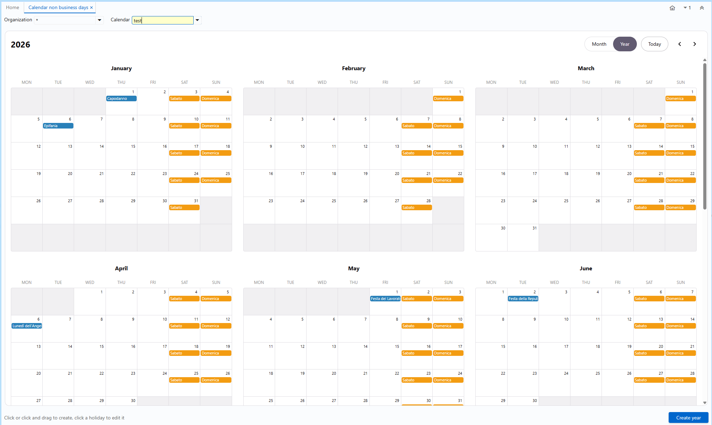
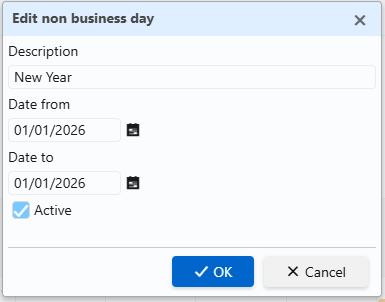

# MsNonBusinessDay

iDempiere plugin to manage non-business days and company closures from a full-screen, interactive calendar, and to shift document dates to the next business day.
Closures are stored in the standard `C_NonBusinessDay` table (per organization and calendar). Public holidays are fetched from a configurable REST holiday API.

## Features

- Full-screen calendar form (`WNonBusinessDayCalendar`) to view and manage non-business days per organization and per calendar, built on FullCalendar.
- Create closures by clicking a day or selecting a range; edit or deactivate existing ones from a contextual dialog.
- Soft delete via an "Active" flag: a closure you untick disappears from the calendar and is not recreated by a later generation.
- Yearly generation that materializes, into `C_NonBusinessDay`: the selected weekend days (country agnostic) and the public holidays of a country fetched from a REST API configured entirely through SysConfig (URL and JSON extraction paths), so any holiday provider can be used without code changes.
- Event handler that shifts invoice pay-schedule due dates and order promised dates to the next business day when the payment term has `IsNextBusinessDay` set.

## Screenshots

Calendar view:

New / edit closure dialog:

## Requirements

- iDempiere 13 (Tycho / eclipse-plugin build), Java 17+.
- The iDempiere server must be able to reach the configured holiday API host (internet or outbound proxy).

## Installation

Deploy the bundle. On first activation, `Incremental2PackActivator` applies `META-INF/2Pack_<version>.zip`, which creates the dictionary objects (messages, the generation process and its parameters, the form and its menu entry).

## Usage

### The calendar screen

1. Open the form from its menu entry.
2. In the top toolbar, pick the **Organization** and the **Calendar**. Closures for the visible range are loaded automatically; moving month/year reloads only the dates in view.
3. Colors: blue events are national public holidays (rows carrying a country), orange events are company closures and weekends.
4. **Create**: click a day, or drag to select a range. The *New* dialog opens; enter a description, confirm the start/end dates and Save. One row per day in the range is created, skipping dates that already exist.
5. **Edit or remove**: click an existing event. The *Edit* dialog opens. Change the description or date, or untick **Active** and Save to deactivate it (soft delete: it leaves the calendar and will not be recreated by a later generation).

### Generating a year

The **Generate year** button launches the `GenerateNonBusinessDays` process. Parameters:
- `CalendarYear`: target year (defaults to next year).
- `AD_Org_ID`: organization scope.
- `C_Calendar_ID`: target calendar.
- `C_Country_ID`: country whose public holidays are fetched (defaults to the client's default country). Its ISO code feeds the `{COUNTRY}` placeholder of the API URL.
- `LIT_YearsToKeep`: retention; older rows of that org are pruned.
- `OnMonday` .. `OnSunday`: which weekdays to materialize as closures.

Generation is idempotent and deduplicates by date, so a public holiday that falls on an already generated weekend does not create a duplicate row.

## Holiday REST API configuration (SysConfig)

Public-holiday generation is driven by these SysConfig keys (client level). URL placeholders: `{COUNTRY}` (ISO, e.g. IT), `{YEAR}`, `{LANG}` (lowercase), `{LANGUP}` (uppercase), `{APIKEY}`.

| Key | Purpose |
| --- | --- |
| `LIT_NBD_API_URL` | URL template with the placeholders above |
| `LIT_NBD_API_KEY` | optional API key, substituted into `{APIKEY}` |
| `LIT_NBD_JSON_LIST` | dotted path to the holidays array (empty = the response is the array) |
| `LIT_NBD_JSON_DATE` | dotted path to the ISO date in each item (e.g. `date.iso`, `startDate`) |
| `LIT_NBD_JSON_NAME` | dotted path to the name in each item (e.g. `name`, `name[0].text`) |
| `LIT_NBD_JSON_FILTER` | optional `path=value`, keep only items whose path equals value (e.g. `nationwide=true`) |

If `LIT_NBD_API_URL` is empty the process logs a message and skips public holidays (weekends are still generated).

### Example: OpenHolidaysAPI (free, no key, Italian names)

- `LIT_NBD_API_URL` = `https://openholidaysapi.org/PublicHolidays?countryIsoCode={COUNTRY}&validFrom={YEAR}-01-01&validTo={YEAR}-12-31&languageIsoCode={LANGUP}`
- `LIT_NBD_JSON_LIST` = _(empty)_
- `LIT_NBD_JSON_DATE` = `startDate`
- `LIT_NBD_JSON_NAME` = `name[0].text`
- `LIT_NBD_JSON_FILTER` = `nationwide=true`

### Example: Calendarific (API key required)

- `LIT_NBD_API_URL` = `https://calendarific.com/api/v2/holidays?api_key={APIKEY}&country={COUNTRY}&year={YEAR}&type=national&language={LANG}`
- `LIT_NBD_API_KEY` = _your key_
- `LIT_NBD_JSON_LIST` = `response.holidays`
- `LIT_NBD_JSON_DATE` = `date.iso`
- `LIT_NBD_JSON_NAME` = `name`

## Business-day date shifting

When a payment term has `IsNextBusinessDay` set, the event handler shifts, on document prepare/complete, the affected dates to the next business day, reading the closures from `C_NonBusinessDay` scoped by the document's organization. It currently covers:

- invoice payment-schedule due dates;
- order promised dates.

This coverage is not exhaustive: it is a starting point, and further document integrations are planned.

## License

Distributed under the GPL-2.0 license, consistent with iDempiere.
